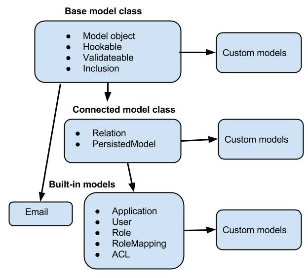

# Loopback 3.x

## Introduction

There are definitely days when you might wake up and say to yourself, "Self, let's build a REST API from the ground up today!"
While you're certainly capable of accomplishing this daunting task, the sheer volume of concerns that need to be addressed when constructing a robust, secure, usable REST API is daunting, at best. Months of your life could be spent constructing the required modules before a user even sees the benefit.
Another option is to use a library like LoopBack that is purpose built by StrongLoop (IBM) to provide a solid, well-designed, standards based RESTful API for your applications.
LoopBack allows you to define models with its handy CLI and generates the API endpoints to perform typical CRUD operations on your data. Validation, authorization, and model relationships are all baked into LoopBack, and you also have plenty of hooks to wire up custom code when you need to.

## Quick Start

[Build a Node.js REST API with LoopBack](https://egghead.io/courses/build-a-node-js-rest-api-with-loopback) [`egghead.io`](egghead.io)

## Basics

*   A key powerful feature of LoopBack is that when you define a model it automatically comes with a predefined REST API with a full set of create, read, update, and delete operations.
*   The Model definition JSON file includes an idInjection property that indicates whether LoopBack automatically adds a unique id property to a model. For a model connected to a database, the id property corresponds to the primary key.
*   Model Hierarchy  
    
*   To specify a project-relative path (for example, to a directory containing static assets), start the string with the prefix $!
*   You can create loopback models directly from the relational database using the Model discovery.
*   Application logic
    1.  Remote Methods (Custom REST endpoints), Remote Hooks (triggered by remote methods) and Operation Hooks (triggered by create, read, update, delete etc.)
    2.  Boot scripts that runs when the application starts
    3.  Custom middleware
*   `/explorer` has the API and `/explorer/swagger.json` has swagger JSON.
>   Create the models in /common even when you are building only the server side.

## Components

*   LoopBack components are predefined packages that extend a basic LoopBack application. Fundamentally, a component is related code bundled together as a unit to enable LoopBack applications for easy reuse. 
*   The bare minimum to meet the LoopBack component “contract” is to export a `function(app, options)` as the main module export.
    1.  API Explorer (Swagger UI)
    2.  OAuth 2.0
    3.  Push Notifications 
    4.  Storage component
    5.  Synchronization
    6.  Third-party login using Passport


## Middleware

*   Middleware registered via the Express API app.use, app.route, app.get (and other HTTP verbs) runs at the beginning of "route" phase.
*   By convention, place middleware functions in the server/middleware directory.
*   `#` in the middleware ID is just an easy way to determine the method name e.g. **loopback#static = loopback.static()**
*   Middlewares can have name, method they are applied to e.g. get/post etc. Paths these should get trigger. For more info read [configuration.](http://loopback.io/doc/en/lb3/Defining-middleware.html#middleware-configuration-properties "Middleware Configuration Properties")
*   If you don’t provide the route, then the middleware will trigger on all routes
*   **Using phases helps to avoid ordering issues that can occur with standard Express middleware.**
*   If you add middleware on the `route` or `route:after` phase, it will not execute after the route is matched. Instead, it will be ignored because the route was already matched.
*   You can put listeners on response in the middleware:
    ```javascript
    module.exports = function() {
        return function tracker(req, res, next) {
            console.log('Request tracking middleware triggered on %s', req.url);
            var start = process.hrtime();
            res.once('finish', function() {
            var diff = process.hrtime(start);
            var ms = diff[0] * 1e3 + diff[1] * 1e-6;
            console.log('The request processing time is %d ms.', ms);
            });
            next();
        };
    };
    ```
    1.  Add the code above to server/middleware/tracker.js.
    2.  Edit (or create) the file server/middleware.json and register the new middleware in the “initial” phase:
    ```
    {
        "initial": {
            "./middleware/tracker": {}
        }
    }
    ```
*   Loopback middleware chain
```javascript
    1.  initial:before
    2.  initial
    3.  initial:after
    4.  session:before
    5.  session
    6.  session:after
    7.  auth:before
    8.  auth
    9.  auth:after
    10. parse:before
    11. parse
    12. parse:after
    13. routes:before
    14. `Express middleware`
    15. `Components`
    16. `Boot scripts`
    17. routes
    18. routes:after
    19. files:before
    20. files
    21. files:after
    22. final:before
    23. final
    24. final:after
```
>   For routes serving JSON, best practice is to create a new model and implement the routes as remote methods. For routes serving non-JSON responses, best practice is to define them the standard “Express way” in server.js or a boot script.

## Boot Scripts

```javascript
    13. routes:before
    14. `Express middleware`
    15. `Components`
    16. `Boot scripts`
    17. routes
```
>   By default loopBack loads boot scripts in alphabetical order.

## Database

We can have boot scripts to load any meta-data at the load of the application.

```javascript
// server/boot/create-sample-models.js

module.exports = function(app) {
  app.dataSources.mysqlDs.automigrate('CoffeeShop', function(err) {
    if (err) throw err;
    app.models.CoffeeShop.create([{
      name: 'Bel Cafe',
      city: 'Vancouver'
    } {
      name: 'Caffe Artigiano',
      city: 'Vancouver'
    } ], function(err, coffeeShops) {
      if (err) throw err;
      console.log('Models created: \n', coffeeShops);
    });
  });
};
```

`Auto-migrate`: Automatically create or re-create the table schemas based on the model definitions.   
`Auto-update`: Automatically alter the table schemas based on the model definitions.

Next:
http://loopback.io/doc/en/lb3/Extend-your-API.html

